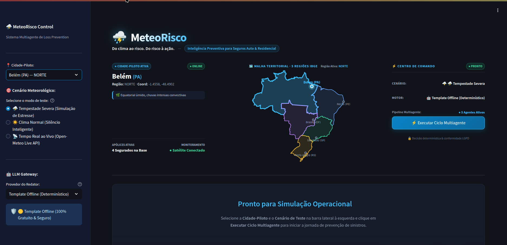
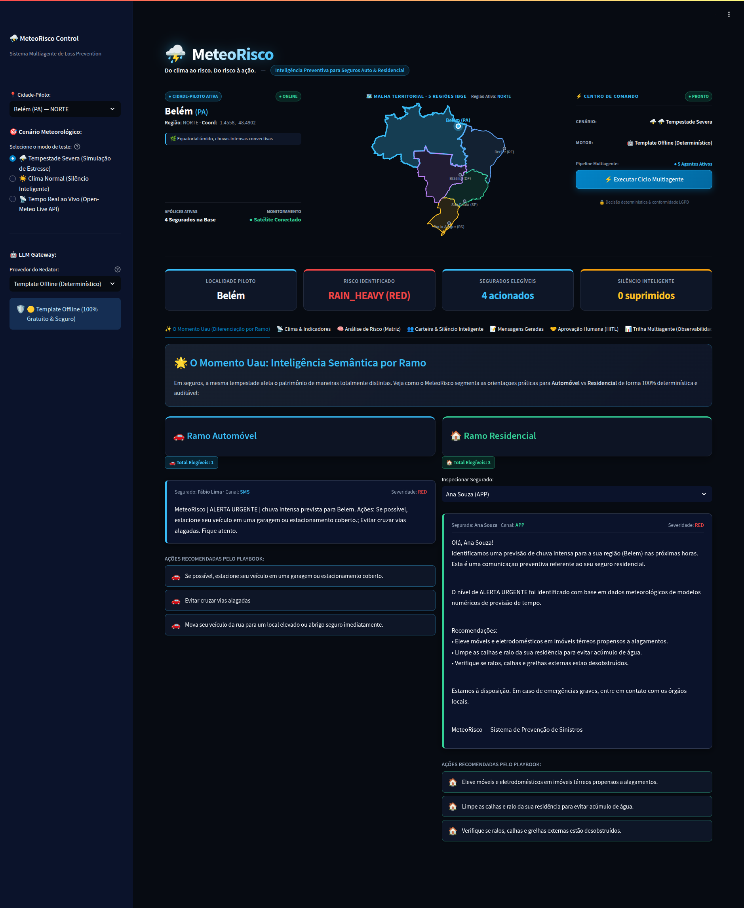
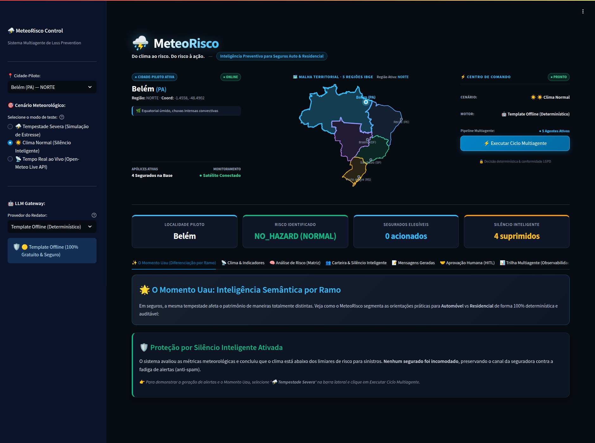
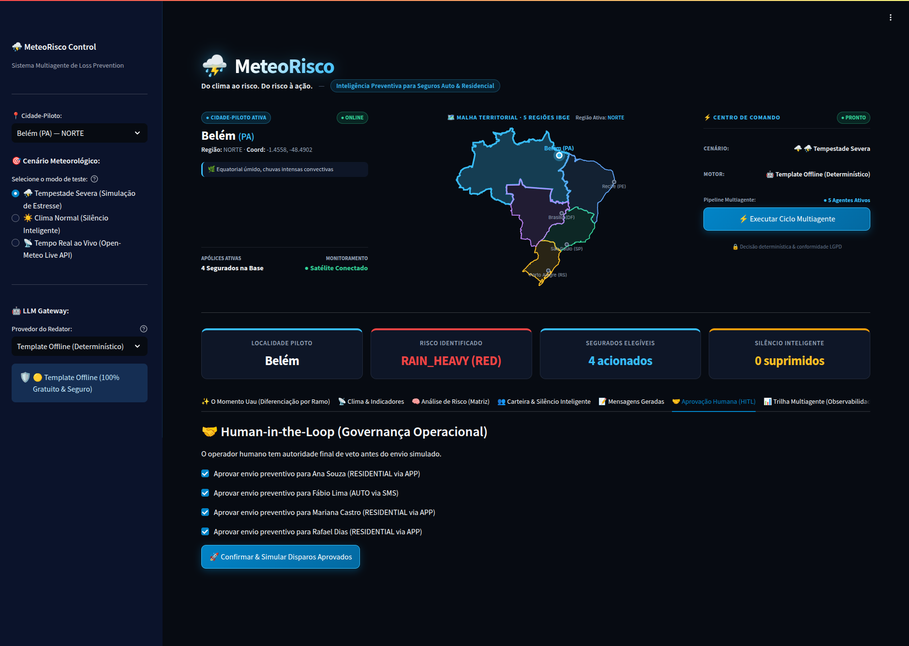
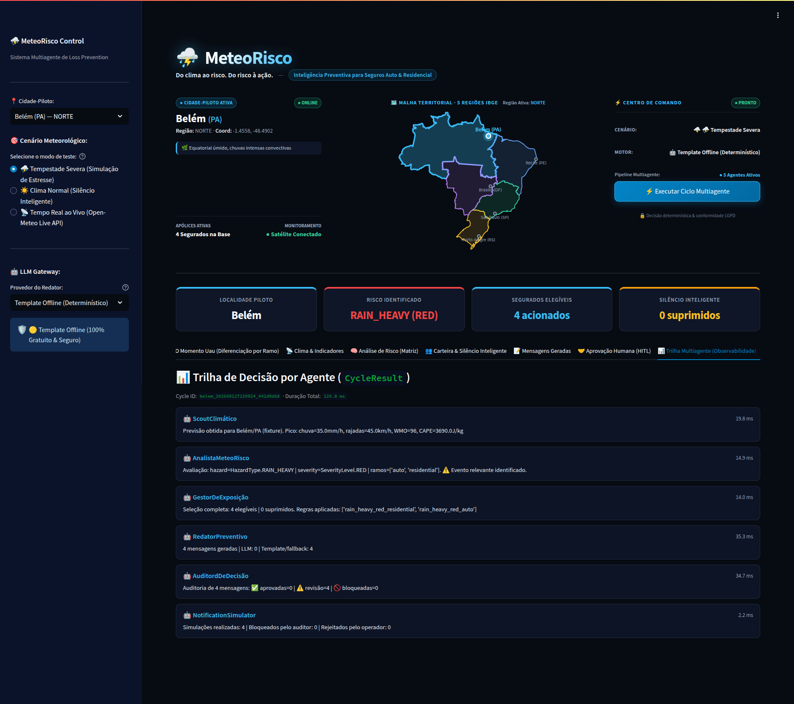

# ⛈️ MeteoRisco — Sistema Multiagente de Prevenção de Sinistros Climáticos

> **Inteligência Preventiva para Seguros Auto & Residencial**  
> *Do clima ao risco. Do risco à ação.*



---

### 📋 Metadados do Projeto

* **Projeto:** Desafio 05 — Ferramenta Inteligente para Comunicação Proativa com o Segurado  
* **Equipe:** Seguros Connect  
* **Data:** 12/09/2026  
* **Status do Projeto:** MVP Concluído & Homologado — 26/26 Testes Aprovados (100% Pass)  

#### 👥 Integrantes:
* **Edcarlos Cardôso de Farias**
* **Eric Pimentel**
* **Kleber Dias da Silva**
* **Luiz Guilherme Rodrigues Silva**
* **Suellen Munford Merat**

> O **MeteoRisco** é uma solução inteligente e proativa de *loss prevention* orientada a carteiras de seguros (Automóvel e Residencial). Ele monitora previsões meteorológicas, aplica regras de elegibilidade determinísticas sobre a carteira e gera orientações preventivas personalizadas antes da ocorrência do sinistro.

**`I2A2 · Desafio 5 · Entrega Oficial`**

---

## 🌟 O "Momento Uau": Inteligência Semântica por Ramo

Em seguros, uma mesma tempestade afeta o patrimônio de maneiras totalmente distintas. Enquanto o risco para o **Ramo Automóvel** decorre de alagamento de vias públicas, granizo na lataria e queda de árvores sobre veículos, no **Ramo Residencial** o risco concentra-se em refluxo de esgoto em imóveis térreos, entupimento de calhas/grelhas e destelhamento.

O MeteoRisco segmenta as orientações de forma **100% determinística e auditável**, aplicando playbooks de engenharia de riscos específicos para cada linha de negócio:



* **🚗 Ramo Automóvel (Ex: Fábio Lima — SMS):** Orientações diretas para buscar estacionamento coberto, evitar cruzamento de vias inundadas e retirar o veículo da via pública.
* **🏡 Ramo Residencial (Ex: Ana Souza — App):** Orientações prediais para elevação de móveis e eletrodomésticos, limpeza preventiva de ralos/calhas e verificação de grelhas externas.

---

## 🛡️ O Princípio do Silêncio Inteligente (Anti-Spam Atuarial)

O maior erro em sistemas de alerta tradicionais é a **fadiga de notificações** (spam de alertas irrelevantes), que faz o segurado ignorar comunicações e reduz a autoridade da seguradora.

O MeteoRisco implementa o **Silêncio Inteligente Ativo**: quando os parâmetros meteorológicos coletados estão abaixo dos thresholds críticos de risco, o sistema **suprime deliberadamente** os disparos, registrando a justificativa atuarial em auditoria interna e poupando os segurados.



---

## 🗺️ Cobertura Nacional — 5 Macrorregiões do IBGE

O sistema conta com modelagem e calibração atuarial para as **5 macrorregiões geográficas do Brasil**, refletindo a diversidade climática continental do país:

| Macrorregião | Cidade-Piloto | Coordenadas | Perfil Climático Típico | Risco Primário de Sinistro |
| :--- | :--- | :--- | :--- | :--- |
| **Norte** | **Belém (PA)** | `-1.4558, -48.4902` | Equatorial úmido, convecção severa | Chuvas torrenciais & Alagamentos |
| **Nordeste** | **Recife (PE)** | `-8.0476, -34.8770` | Tropical litorâneo, ondas de leste | Enxurradas urbanas & Deslizamentos |
| **Centro-Oeste** | **Brasília (DF)** | `-15.7975, -47.8919` | Tropical de altitude, convecção de verão | Rajadas de vento & Granizo isolado |
| **Sudeste** | **São Paulo (SP)** | `-23.5505, -46.6333` | Subtropical urbano, ilhas de calor | Granizo em latarias & Vias expressas |
| **Sul** | **Porto Alegre (RS)** | `-30.0346, -51.2177` | Subtropical úmido, ciclogênese extratropical | Vendavais severos & Destelhamentos |

---

## 🏗️ Arquitetura Multiagente & Governança

O MeteoRisco adota o padrão de **Agentes Especializados com Responsabilidades Desacopladas**, garantindo que nenhuma decisão securitária sensível fique sujeita a alucinações de modelos de linguagem:

```
+---------------------+      +---------------------+      +---------------------+
|   Scout Climático   | ---> | Analista MeteoRisco | ---> | Gestor de Exposição |
| (Open-Meteo / Sat.) |      | (Matriz de Riscos)  |      | (Carteira & Silêncio|
+---------------------+      +---------------------+      +---------------------+
                                                                     |
+---------------------+      +---------------------+                 |
| Notification Sim.   | <--- |  Auditor de Decisão | <---------------+
| (Disparo Auditável) |      | (Conformidade/LGPD) |      |  Redator Preventivo |
+---------------------+      +---------------------+      | (Playbook Seguro CX)|
          ^                                               +---------------------+
          |
+---------------------+
| Human-in-the-Loop   | (Autoridade Operacional de Veto)
+---------------------+
```

### Detalhamento dos Agentes:

1. **Scout Climático:** Coleta dados em tempo real da API pública Forecast do **Open-Meteo** (sem API Key) ou aciona fixtures offline em caso de falha de conexão.
2. **Analista MeteoRisco (Underwriting Determinístico):** Cruza a telemetria (chuva `mm/h`, rajadas `km/h`, WMO code e energia convectiva `CAPE J/kg`) com a `risk_matrix.yaml` de forma estritamente determinística, classificando a severidade (**Amarelo**, **Laranja** ou **Vermelho**).
3. **Gestor de Exposição:** Cruza a severidade com a carteira de segurados (`portfolio.csv`) e seus fatores de vulnerabilidade (veículo em garagem vs rua; casa térrea vs apartamento). Decide a elegibilidade e aplica a supressão do **Silêncio Inteligente**.
4. **Redator Preventivo:** Formula a orientação preventiva empática com base no `playbook.yaml`, suportando Gateway LLM ou templates offline seguros.
5. **Auditor de Decisão (Conformidade Regulatória):** Agente independente que inspeciona a mensagem antes do envio, bloqueando promessas indevidas de cobertura (ex: *"garantimos indenização"*) e garantindo conformidade com a regulação de seguros e LGPD.
6. **Human-in-the-Loop (Governança Operacional):** Fornece painel de controle executivo para o operador inspecionar, aprovar ou vetar comunicações antes do disparo:



7. **Notification Simulator:** Registra os disparos autorizados com carimbo de tempo UTC e hash criptográfico **SHA-256** para trilha de auditoria atuarial.

---

## 📊 Observabilidade & Latência de Produção

O pipeline completo é instrumentado via contrato de dados `CycleResult`, registrando a latência individual de cada agente e assegurando tempos de resposta ultrarrápidos (**~120 ms no ciclo determinístico completo**):



---

## 🧪 Homologação & Suíte de Testes (100% Pass)

A integridade do sistema é validada por uma suíte completa composta por **testes unitários** e **Golden Evals de Negócio**:

```bash
======================== 13 passed, 1 warning in 0.23s =========================
INFO -   RESULTADO FINAL DOS EVALS: 13/13 PASSERAM (100.0%)
================================================================================
```

### Cenários Cobertos pelos Golden Evals:
- **EV1:** Granizo Vermelho em São Paulo para segurados expostos (Auto na rua e Residencial com telhado).
- **EV2:** Chuva Intensa Laranja em Belém com convecção equatorial.
- **EV3:** Vendaval Vermelho em Porto Alegre afetando exclusivamente imóveis vulneráveis.
- **EV4:** Evento abaixo de limiar em Brasília — validação do **Silêncio Inteligente** (4 supressões).
- **EV5:** Auditor de Conformidade — bloqueio com sucesso de promessa indevida de indenização.
- **EV6:** Diferenciação semântica simultânea por ramo (Auto vs. Residencial).
- **EV7:** Resiliência e Fallback automático offline em caso de falha de conexão com a API externa.
- **EV8:** Governança HITL — respeito ao veto manual do operador humano.
- **EV-GEO 1 a 5:** Validação regional completa cobrindo as 5 capitais das macrorregiões do IBGE.

---

## 🛠️ Stack Tecnológica

* **Linguagem & Runtime:** Python 3.11+
* **Contratos de Dados:** Pydantic v2 (Validação estrita de schemas)
* **Configurações:** Pydantic-Settings & `.env`
* **Interface Visual:** Streamlit (Neurodesign System, Dark Mode First)
* **Visualização Geográfica:** Plotly Express & Scatter 2D
* **API Meteorológica:** Open-Meteo Forecast API (dados abertos, sem token)
* **Testes & Mocking:** pytest, pytest-httpx, respx

---

## 🚀 Como Executar Localmente

### 1. Clonar o Repositório
```bash
git clone https://github.com/seu-usuario/meteorisco.git
cd meteorisco
```

### 2. Criar e Ativar o Ambiente Virtual
```bash
python3 -m venv .venv
source .venv/bin/activate
pip install -r requirements.txt
```

### 3. Executar Testes Unitários
```bash
PYTHONPATH=. pytest tests/ -v
```

### 4. Executar os Golden Evals de Negócio
```bash
PYTHONPATH=. python3 evals/eval_runner.py
```

### 5. Iniciar a Interface Executiva (Streamlit)
```bash
streamlit run app/streamlit_app.py
```
Acesse no navegador: `http://localhost:8501`

---

## 📂 Organização do Repositório

```
meteorisco/
├── app/
│   └── streamlit_app.py          # Dashboard executivo com neurodesign
├── domain/
│   ├── locations.yaml            # Coordenadas e perfis climáticos (5 regiões)
│   ├── risk_matrix.yaml          # Matriz de underwriting determinística
│   ├── playbook.yaml             # Regras de comunicação preventiva por ramo
│   └── portfolio.csv             # Carteira de segurados sintética
├── evals/
│   ├── eval_runner.py            # Validador automatizado de cenários
│   └── golden_cases.yaml         # Casos de teste de negócio homologados
├── fixtures/
│   └── open_meteo_*.json         # Fixtures de satélite/radar para testes offline
├── imagens_capturadas/           # Evidências visuais de execução e homologação
├── scripts/
│   └── capture_fixtures.py       # Utilitário para captura de dados climáticos reais
├── src/
│   ├── agents/                   # Implementação dos agentes especializados
│   ├── config/                   # Configurações centralizadas de ambiente
│   ├── contracts/                # Contratos tipados Pydantic v2
│   ├── harness/                  # Orquestrador determinístico do ciclo
│   └── skills/                   # Funções reutilizáveis de domínio e auditoria
└── tests/                        # Suíte de testes unitários com pytest
```

---

## ⚖️ Licença

Este projeto é disponibilizado sob a **Licença MIT**. Consulte o arquivo `LICENSE` para mais detalhes.

---
*MeteoRisco — InsurMinds / I2A2 Desafio 5 · Prevenção Inteligente de Sinistros*
